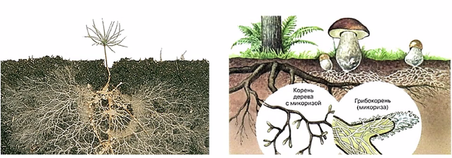
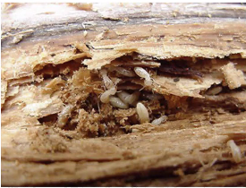
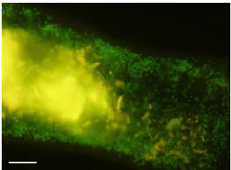
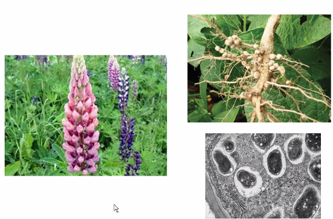
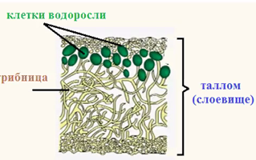
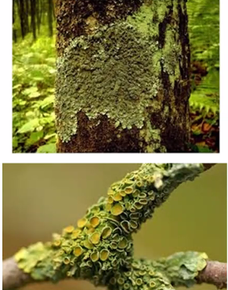

## *Экология*

# Биотические факторы

Охватывают другие организмы, с которыми организм взаимодействует.

Основные типы экологических взаимодействий:

- нейтральные. 0 : 0
- Взаимополезный (+ : +):
  - Протокооперацию (нафиг)
  - Симбиоз
  - Мутуализм
- Полезно-нейтральные — комменсализм
  - Нахлебничество
  - Сотрапезничество
  - Квартиранство
- Полезно-вредные
  - Хищничество
  - Паразитизм
- Взаимно-вредные (- : -) (конкуренция)
  - Межвидовая
  - Внутривидовая
- Вредно-нейтральная, не нужны (- : 0).

Примеры.

- Рак-отшельник и актиния; Протокооперация//мутализм 

  Рак-отшельник ест отходы актинии, актиния ест отходы рака, рак возит актинию. Рак переселяет актинию на свою новую раковину (отрывает клешнями).

  > Протокооперация — взаимно выгодно, но не обязательно.

- Насекомые-опылители. Полезно и тем, и другим. Насекомым — источник питания, для растений — опыление. У многих растений нет строгой специализации на насекомых, как и у насекомых — могут друг без друга, поэтому скорее протокооперация.

  > Мутуализм (факультативный, необязательный симбиоз) — взаимодействие между двумя видами, приносящее обоюдную пользу.

- Муравьи и тли. Муравьи охраняют, тли кормят муравьев своим секретом.

- Коралловые полипы и водоросли. Коралловые полипы неподвижны, а зеленые водоросли синтезируют органику. Полипы — хороший субстрат и защита для роста, едят органику, которую синтезируют зеленые водоросли.

> Облигатный симбиоз — неразрывное взаимодействие двух организмов, приносящее им обоюдную пользу.

- Микориза — грибы, в т.ч. шляпочные, образовывающие грибницу (мицелий), прорастающую внутрь корней высших растений. Гриб получает органику, растение — минералы. Деревья без микоризы сильно хуже приживаются.

- Термиты, простейшие, бактерии. Термиты, поедающие древесину, не имеют ферментов, способных разложить эту древесину. Переваривание осуществляется бактериями в кишечники. Молодняк лижет выделения взрослых для получения простейших. Бактерии в кишечнике:

   Такое есть и у нас в организме, как и у термитов. Например, для переработки целлюлозы, из которой построены растительные клетки. Мы носим *1 ~ 5 кг* бактерий в кишечнике.

- Симбиоз бобовых и бактерий в клубнях. Бактерии получают органику и защиту. Бактерии — азотофиксаторы.

   

  Способность использовать атмосферный азот для синтеза азотных соединений. Организмов-азотофиксаторов совсем немного, только благодаря им мы можем использовать атмосферный азот. На слайде — эукариотная клетка в клубне.

- Лишайники.

  

  Сверху — грибница, уникальный природный случай.

# Теория симбиогенеза

Константин Сергеевич Мережковский (1855 - 1921 г.г.) — "умозрительная теория", не было аргументов. 

Независимо (под вопросом) — в начале 60-ых годов, американская исследовательница Линн Маргулис. 

Симбиогенная теория происхождения эукариотной клетки — сейчас считается общепринятой. <u>Митохондрии</u> (из альфапротеобактерий) и <u>пластиды</u> (из цианобактерий) слились, "поглотились" археями (под вопросом) — клеткой, способной к фагоцитозу.

Свидетельства поглощения митохондрии:

- двойная мембрана
- своя кольцевая ДНК
- собственные рибосомы
- "свой" способ размножения

Аналогично (?) с пластидами. 

# Конец

##　Привет ВБ

