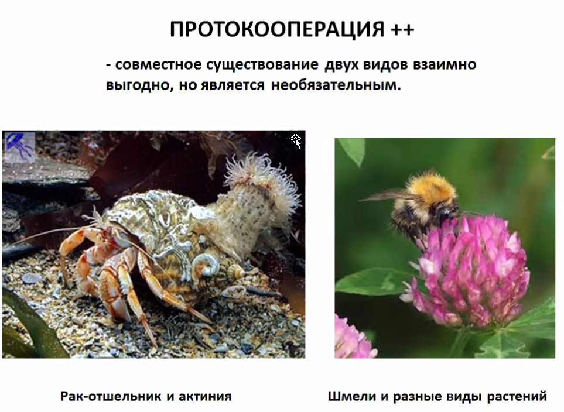
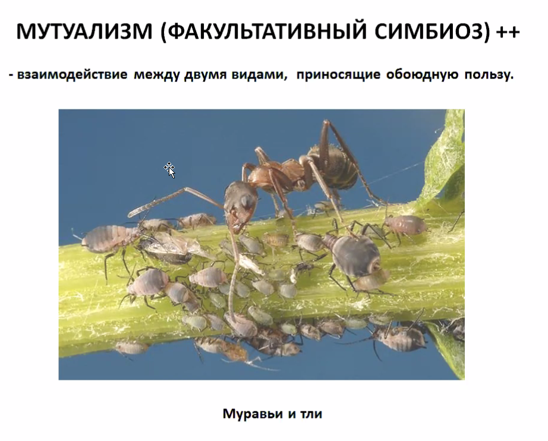
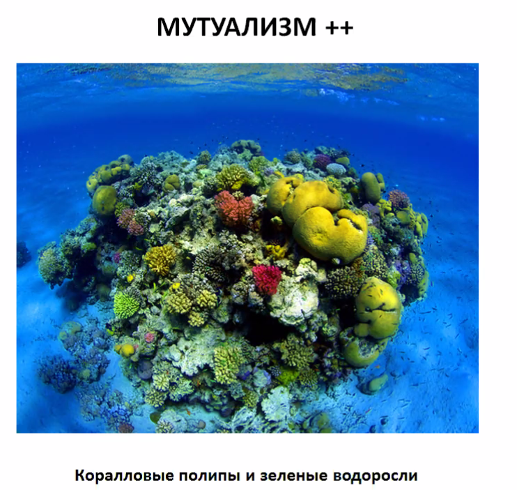
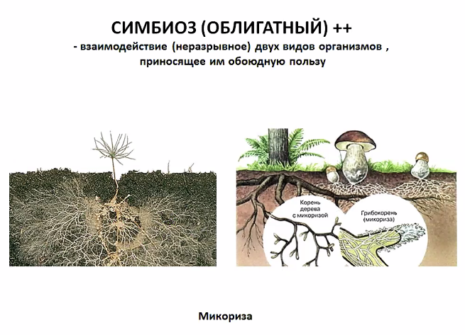
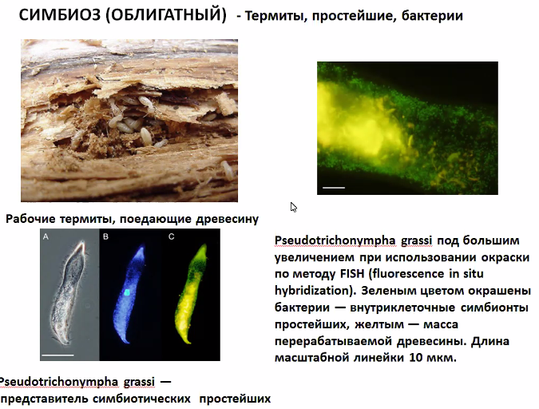
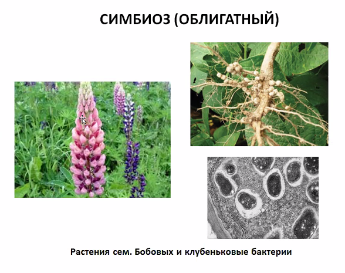
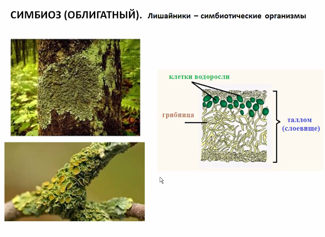
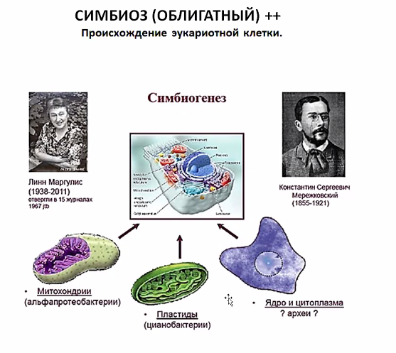

# Экология

Это нетолько охрана природы.
Это наука о взаимоотношениях организмов и охране окружающей среды.

#### Факторы среды:
- Биотические факторы - другие организмы из живой среды
- Абиотические - не из живой природы
- Антропогенные - от людей

#### Предел выносливости 
это значение фактора, 
за границами которых существование данного вида организмов невозможно

График зависимости интенсивности жизнедеятельности (то есть колчества особей)
от значения фактора — нормальное распределениие

Факторы - температура, влажность и «прочая дрянь».

Существуют зона оптимума и зона пессимума

</img>

</img>

#### Эвритермные организмы — выдержиивают колебания температуры в широких пределах
Пример: песец

#### Стенотермные организмы — выдержиивают колебания температуры в УЗКИХ пределах
Пример: коралловые полипы (≈20°C)

#### Эвригалинные организмы — выдержиивают колебания СОЛЁНОСТИ в широких пределах
Примеры: Лососёвые (Сёмга, Горбуша…)

### Правило ограничивающих факторов (Правило Либиха / закон минимума)
                                                        ^^^ <-- Химик
«Возможность существования организмов в первую очередь ограничивают те факторы среды, 
которые наиболее отклонятюся от оптимума»

</img>

«оса агаонида» — фиговая оса — опылитель инжира

Ограничивающие факторы: 
- Север => температура
- Пустыня => влажность
- … => …
…

Хладнокровные — «» — t_вокруг = t_внутри

Морфологические адаптации

Согревание за счёт мышц при низких температурах окружающего воздуха 
Испарительная терморегуляция

______________________________________________

#### Морфоолгические способы регуляции водного балланса у животных:
- Эпикутикула
- Раковина моллюсков

#### Физиологические способы регуляции водного балланаса
- Обратное всасывание
- Мочевина
- Метаболическая влага (горбы верблюда)

#### Светолюбивые растения (гелиофиты)

#### Теневыносливые растения
Цветовая мозаика (одни листья не затеняют другие)

### Ориентация у животных и свет
(Для ориентации в пространстве животным действительно нужен свет)

##### Органы зрения. 
- Головоногие моллюски, осьминог
- Млекопитающие почти не имеют цветного зрения
- Птицы имеют
- Гипертрофия глаз

Танцы пчёл связаны с солнцем и его перемещением
Перелёты птиц

Фотопериодизм — реакция организмов на сезонные изменения длины дня

## Биотические (теперь не только А'биотические) факторы
### Взаимодействия в природе
- Нейтральные (нейтрализм: ø:ø)
- Взаимополезные: +:+
    - Симбиоз
    - Мутуализм / протокооперация <- Если протокооперация, то обязательно взаимовыгдоно
- Полезно-нейтральные: +:ø
    - Комменсиализм
- Полезно-Вредные: +:-
    - Хищничество
    - Паразитизм
- Взаимно-вредные: -:-
    - конкуренция

#### Протокооперация
</img>

#### Мутуализм
</img>
</img>

#### Симбиоз — облигатный мутуализм. «ОБА Не могут жить друг друг без друга»
</img>
</img>
</img>
</img>
#### Теория симбмогенеза — теория происхождения эукариотной клетки
Общепринято, что были некоторые бакткрии. В результате симбиоза некоторые типы были поглощены клеткой хозяином 
(с ядром; способной к фагоцитизу) и стали метахондриями / пластидами.
</img>

