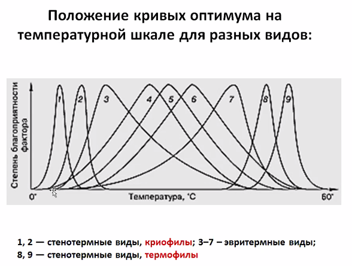

# Экология

Это нетолько охрана природы.
Это наука о взаимоотношениях организмов и охране окружающей среды.

#### Факторы среды:
- Биотические факторы - другие организмы из живой среды
- Абиотические - не из живой природы
- Антропогенные - от людей

#### Предел выносливости 
это значение фактора, 
за границами которых существование данного вида организмов невозможно

График зависимости интенсивности жизнедеятельности (то есть колчества особей)
от значения фактора — нормальное распределениие

Факторы - температура, влажность и «прочая дрянь».

Существуют зона оптимума и зона пессимума

</img>
