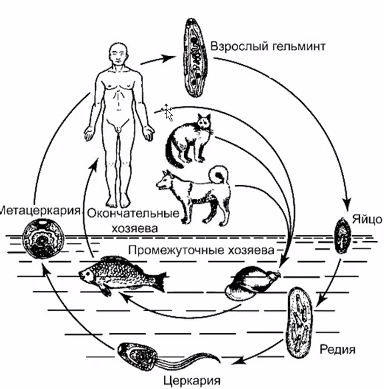
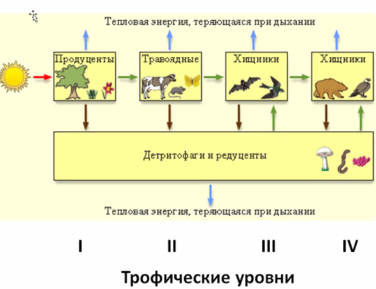

# *Экология*

## Биотические факторы

Охватывают другие организмы, с которыми организм взаимодействует.

### Основные типы экологических взаимодействий:

- нейтральные. 0 : 0

- Взаимополезный (+ : +):

  - Протокооперацию (нафиг)
  - Симбиоз
  - Мутуализм

- Полезно-нейтральные — комменсализм

  - Нахлебничество
- Сотрапезничество
  - Квартиранство

- Полезно-вредные

  - Хищничество
  - Паразитизм

- Взаимно-вредные (- : -) (конкуренция)

  - Межвидовая
  - Внутривидовая

- Вредно-нейтральная, не нужны (- : 0).

### Симбиоз

- Рак-отшельник и актиния; Протокооперация//мутализм 

  Рак-отшельник ест отходы актинии, актиния ест отходы рака, рак возит актинию. Рак переселяет актинию на свою новую раковину (отрывает клешнями).

  > Протокооперация — взаимно выгодно, но не обязательно.

- Насекомые-опылители. Полезно и тем, и другим. Насекомым — источник питания, для растений — опыление. У многих растений нет строгой специализации на насекомых, как и у насекомых — могут друг без друга, поэтому скорее протокооперация.

  > Мутуализм (факультативный, необязательный симбиоз) — взаимодействие между двумя видами, приносящее обоюдную пользу.

- Муравьи и тли. Муравьи охраняют, тли кормят муравьев своим секретом.

- Коралловые полипы и водоросли. Коралловые полипы неподвижны, а зеленые водоросли синтезируют органику. Полипы — хороший субстрат и защита для роста, едят органику, которую синтезируют зеленые водоросли.

> Облигатный симбиоз — неразрывное взаимодействие двух организмов, приносящее им обоюдную пользу.

- Микориза — грибы, в т.ч. шляпочные, образовывающие грибницу (мицелий), прорастающую внутрь корней высших растений.

-  Гриб получает органику, растение — минералы. Деревья без микоризы сильно хуже приживаются.

- Термиты, простейшие, бактерии. Термиты, поедающие древесину, не имеют ферментов, способных разложить эту древесину.

-  Переваривание осуществляется бактериями в кишечники. Молодняк лижет выделения взрослых для получения простейших. Бактерии в кишечнике:

   Такое есть и у нас в организме, как и у термитов. Например, для переработки целлюлозы, из которой построены растительные клетки. Мы носим *1 ~ 5 кг* бактерий в кишечнике.

- Симбиоз бобовых и бактерий в клубнях. Бактерии получают органику и защиту. Бактерии — азотофиксаторы.

   

  Способность использовать атмосферный азот для синтеза азотных соединений. Организмов-азотофиксаторов совсем немного, только благодаря им мы можем использовать атмосферный азот. На слайде — эукариотная клетка в клубне.

- Лишайники.

  

  Сверху — грибница, уникальный природный случай.

#### Теория симбиогенеза

Константин Сергеевич Мережковский (1855 - 1921 г.г.) — "умозрительная теория", не было аргументов. 

Независимо (под вопросом) — в начале 60-ых годов, американская исследовательница Линн Маргулис. 

Симбиогенная теория происхождения эукариотной клетки — сейчас считается общепринятой. <u>Митохондрии</u> (из альфапротеобактерий) и <u>пластиды</u> (из цианобактерий) слились, "поглотились" археями (под вопросом) — клеткой, способной к фагоцитозу.

Свидетельства поглощения митохондрии:

- двойная мембрана
- своя кольцевая ДНК
- собственные рибосомы
- "свой" способ размножения

Аналогично (?) с пластидами. 

### Комменсализм

- нахлебничество

  

  Грифы доедают остатки жертв львов, прилипалы — остатки еды акул. Почти не мешают.

- сотрапезничество

  Разные части одного пищевого ресурса — все славки используют одно и то же дерево. Или 

  

  вредители на одной и той же яблоне. Друг другу не мешают. Якобы нейтрально для яблони.

  

- квартиранство

  

  Рост эпифитов в неровностях и загнивающих частях коры, гнездовье сов в дуплах и разломах деревьев. Для деревьев нейтрально, для обитателей — полезно. 

     

  Рачки — селятся на теле кита. Репей на собаках — размножение, очень нужно растениям.

### Хищничество

Потребление одних организмов другими. 

Строго формально, потребление растений зайцем — тоже хищничество. Бывают хищные растения. На дне кувшинчике непентеса — жидкость с ферментами и водой (растет в тропическом лесу, вода сама наливается).

### Паразитизм

Экзопаразиты — снаружи прицепляются, эндо — внутри (в первую очередь черви). Не могут существовать без паразитизма, не убивают хозяина. Представители очень разные по классам. И прокариоты, и простейшие, и грибы, и черви, и насекомые, и т.д.…

  

Церкарии (человек получает от рыб, морская рыба — не опасна):

У растений:

### Конкуренция

Отрицательна для всех участников, помогает в естественном отборе. Виды:

- внутривидовая:

  

- межвидовая:

  

Ярусность леса — результат конкуренции за влагу, свет и минеральные вещества. 

## Экосистемы

#### Определения

Биотоп — участок поверхности с определенными абиотическими условиями, на котором существует сообщество организмов.

Биоценоз — совокупность организмов, обитающих на участке внешней среды с однородными условиями (т.е. в биотопе в течение длительного времени)

> Лужа — не биоценоз, так как она пересыхает

Экосистема примерно соответствует биоценозу, но более широкое понятие. Очень распространенное понятие. «Экосистемой можно считать все что угодно: от капли воды до океана».

Биогеоценоз — совокупность условий внешней среды + биоценоз. Т.е. учитывает и внешнюю среду, и сами организмы. 

Популяция (существует длительное время):

- часть населения вида, обитающая на определенной площади, где происходит обмен генетической информацией и взаимодействие особей

Показатель процветания популяции — высокая численность.

Организмы в биоценоз, в первую очередь, объединяют трофические отношения (кто кого ест, пищевые отношения).

 Бесконечное преобразование энергии.

Пищевая цепь — ряд организмов, связанных друг с другом пищевыми отношениями. По ним идет перенос энергии. Основной источник энергии — Солнце, затем продуценты (~~растения~~ фотосинтетики, превращают Солнечную энергию в энергию связей). Органику потребляют травоядные, затем хищники разного порядка — разные трофические растения.

 Трупы нужно перерабатывать, чтобы мертвая органика не накапливалась. Т.е. остатки должны быть возвращены в неживую природу. Этим занимаются детритофаги, "переработчики мертвой органики" — черви, грибы, бактерии и т.д. 

Важно:

(не буду повторять соответствия, слишком очевидно)

Без любого из элементов все может развалиться.

В пищевой цепи энергия идет как:

На каждом из трофических уровней — огромные потери энергии. <u>На порядок</u>. Потери на дыхание, CO~2~, H~2~O. Не вся продукция с одного уровня переходит на следующий; часть теряется при гибели и т.д. Отсюда — чем дальше, тем меньше биомасса. Самая большая биомасса — у автотрофов.

 

Возврат веществ в экосистему. Графическое изображение (пирамиды, снизу — нижние уровни, сверху — высшие): 

«Парадоксальные» формы могут встречаться на пирамиде численности из-за размеров организмов (при этом пирамида биомассы остается такой же):

[[_TOC_]]

