# Экология

Это нетолько охрана природы.
Это наука о взаимоотношениях организмов и охране окружающей среды.

#### Факторы среды:
- Биотические факторы - другие организмы из живой среды
- Абиотические - не из живой природы
- Антропогенные - от людей

#### Предел выносливости 
это значение фактора, 
за границами которых существование данного вида организмов невозможно

График зависимости интенсивности жизнедеятельности (то есть колчества особей)
от значения фактора — нормальное распределениие

Факторы - температура, влажность и «прочая дрянь».

Существуют зона оптимума и зона пессимума

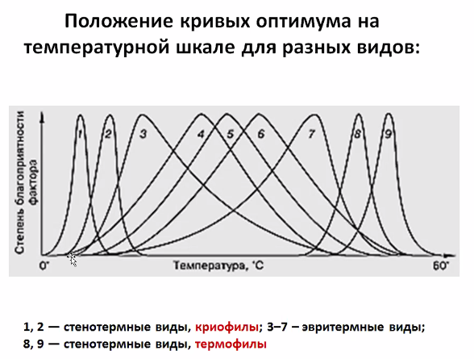</img>

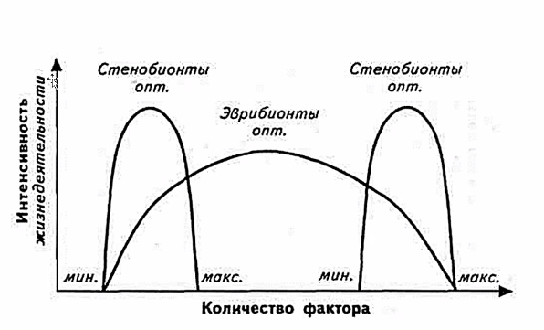</img>

#### Эвритермные организмы — выдержиивают колебания температуры в широких пределах
Пример: песец

#### Стенотермные организмы — выдержиивают колебания температуры в УЗКИХ пределах
Пример: коралловые полипы (≈20°C)

#### Эвригалинные организмы — выдержиивают колебания СОЛЁНОСТИ в широких пределах
Примеры: Лососёвые (Сёмга, Горбуша…)

### Правило ограничивающих факторов (Правило Либиха / закон минимума)
                                                        ^^^ <-- Химик
«Возможность существования организмов в первую очередь ограничивают те факторы среды, 
которые наиболее отклонятюся от оптимума»

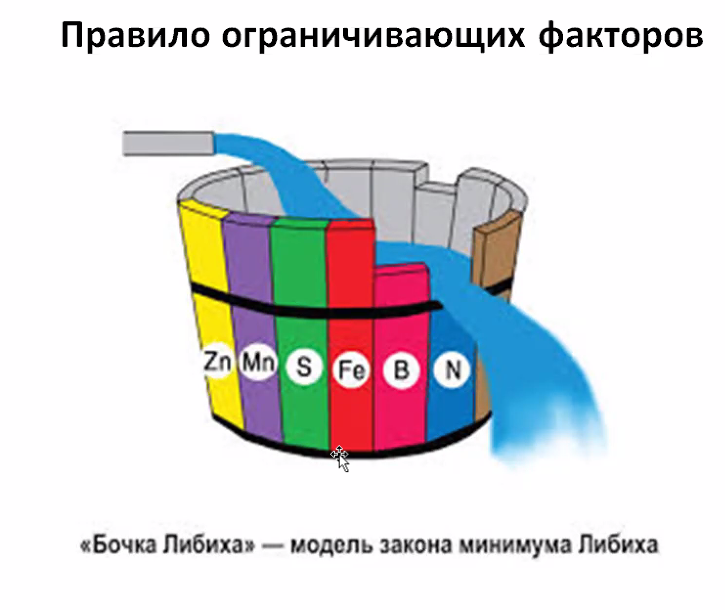</img>

«оса агаонида» — фиговая оса — опылитель инжира

Ограничивающие факторы: 
- Север => температура
- Пустыня => влажность
- … => …
…

Хладнокровные — «» — t_вокруг = t_внутри

Морфологические адаптации

Согревание за счёт мышц при низких температурах окружающего воздуха 
Испарительная терморегуляция

______________________________________________

#### Морфоолгические способы регуляции водного балланса у животных:
- Эпикутикула
- Раковина моллюсков

#### Физиологические способы регуляции водного балланаса
- Обратное всасывание
- Мочевина
- Метаболическая влага (горбы верблюда)

#### Светолюбивые растения (гелиофиты)

#### Теневыносливые растения
Цветовая мозаика (одни листья не затеняют другие)

### Ориентация у животных и свет
(Для ориентации в пространстве животным действительно нужен свет)

##### Органы зрения. 
- Головоногие моллюски, осьминог
- Млекопитающие почти не имеют цветного зрения
- Птицы имеют
- Гипертрофия глаз

Танцы пчёл связаны с солнцем и его перемещением
Перелёты птиц

Фотопериодизм — реакция организмов на сезонные изменения длины дня

## Биотические (теперь не только А'биотические) факторы
### Взаимодействия в природе
- Нейтральные (нейтрализм: ø:ø)
- Взаимополезные: +:+
    - Симбиоз
    - Мутуализм / протокооперация <- Если протокооперация, то обязательно взаимовыгдоно
- Полезно-нейтральные: +:ø
    - Комменсиализм
- Полезно-Вредные: +:-
    - Хищничество
    - Паразитизм
- Взаимно-вредные: -:-
    - конкуренция

#### Протокооперация
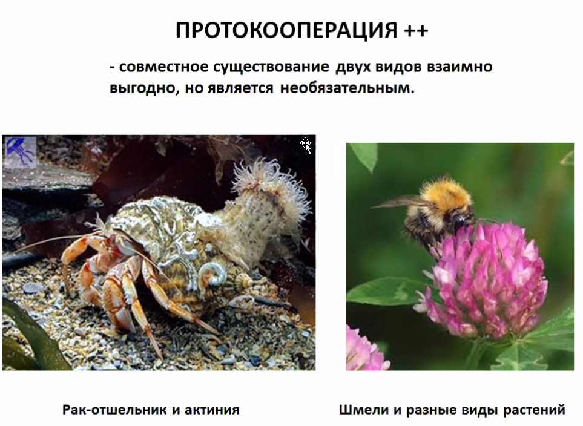</img>

#### Мутуализм
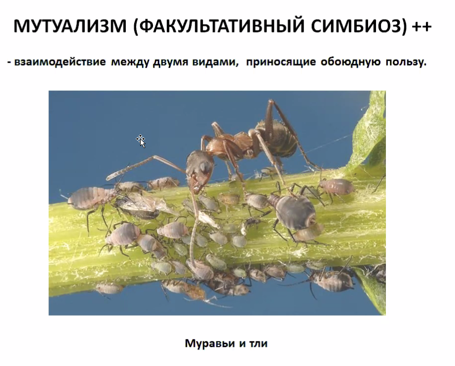</img>
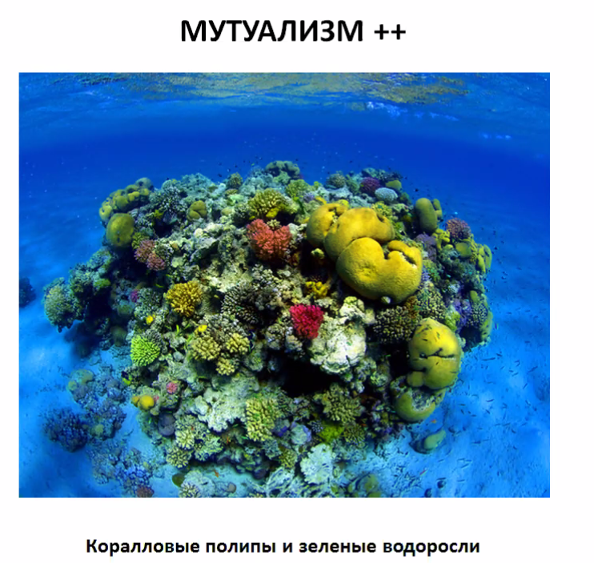</img>

#### Симбиоз — облигатный мутуализм. «ОБА Не могут жить друг друг без друга»
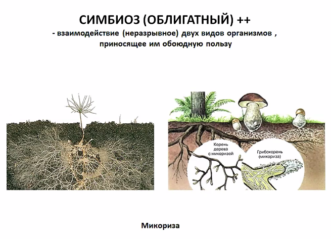</img>
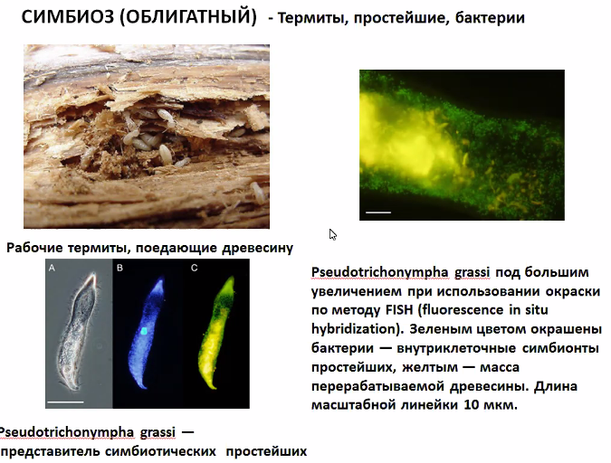</img>
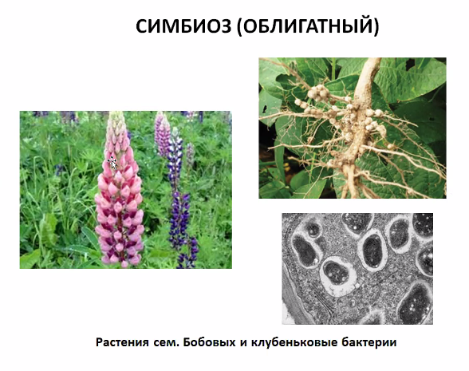</img>
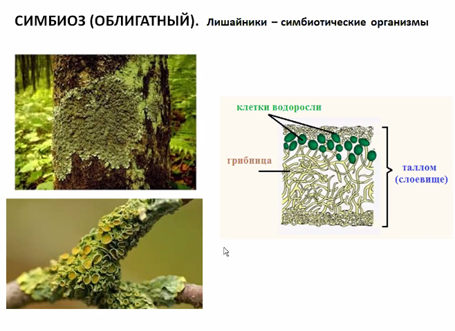</img>

#### Теория симбмогенеза — теория происхождения эукариотной клетки
Общепринято, что были некоторые бакткрии. В результате симбиоза некоторые типы были поглощены клеткой хозяином 
(с ядром; способной к фагоцитизу) и стали метахондриями / пластидами.
</img>

## Экосистемы

#### Определения

Биотоп — участок поверхности с определенными абиотическими условиями, на котором существует сообщество организмов.

Биоценоз — совокупность организмов, обитающих на участке внешней среды с однородными условиями (т.е. в биотопе в течение длительного времени)

> Лужа — не биоценоз, так как она пересыхает

Экосистема примерно соответствует биоценозу, но более широкое понятие. Очень распространенное понятие. «Экосистемой можно считать все что угодно: от капли воды до океана».

Биогеоценоз — совокупность условий внешней среды + биоценоз. Т.е. учитывает и внешнюю среду, и сами организмы. 

Популяция (существует длительное время):

- часть населения вида, обитающая на определенной площади, где происходит обмен генетической информацией и взаимодействие особей

Показатель процветания популяции — высокая численность.

Организмы в биоценоз, в первую очередь, объединяют трофические отношения (кто кого ест, пищевые отношения).

 Бесконечное преобразование энергии.

Пищевая цепь — ряд организмов, связанных друг с другом пищевыми отношениями. По ним идет перенос энергии. Основной источник энергии — Солнце, затем продуценты (~~растения~~ фотосинтетики, превращают Солнечную энергию в энергию связей). Органику потребляют травоядные, затем хищники разного порядка — разные трофические растения.

 Трупы нужно перерабатывать, чтобы мертвая органика не накапливалась. Т.е. остатки должны быть возвращены в неживую природу. Этим занимаются детритофаги, "переработчики мертвой органики" — черви, грибы, бактерии и т.д. 

Важно:

(не буду повторять соответствия, слишком очевидно)

Без любого из элементов все может развалиться.

В пищевой цепи энергия идет как:

На каждом из трофических уровней — огромные потери энергии. <u>На порядок</u>. Потери на дыхание, CO~2~, H~2~O. Не вся продукция с одного уровня переходит на следующий; часть теряется при гибели и т.д. Отсюда — чем дальше, тем меньше биомасса. Самая большая биомасса — у автотрофов.

 

Возврат веществ в экосистему. Графическое изображение (пирамиды, снизу — нижние уровни, сверху — высшие): 

«Парадоксальные» формы могут встречаться на пирамиде численности из-за размеров организмов (при этом пирамида биомассы остается такой же):

### Пищевые отношения 

##### (прямо как производственные: все кушают друг друга)

- Продуценты — генерируют органику из минеральных веществ

- Консументы (1, 2, 3, 4, «*5*» порядков): консументы n-ного порядка поедают консументов (n - 1)-го порядка и регулируют их численность, если n != 1, иначе — питаются продуцентами. Консументы «*5*»-го порядка — это паразиты

- Редуценты (трупоядные, грибы, бактерии): разлагают органику

  Происходит потеря энергии при движении к более высокому трофическому уровню.

  ______

  ###### Пирамиды, демонстрирующие это:

  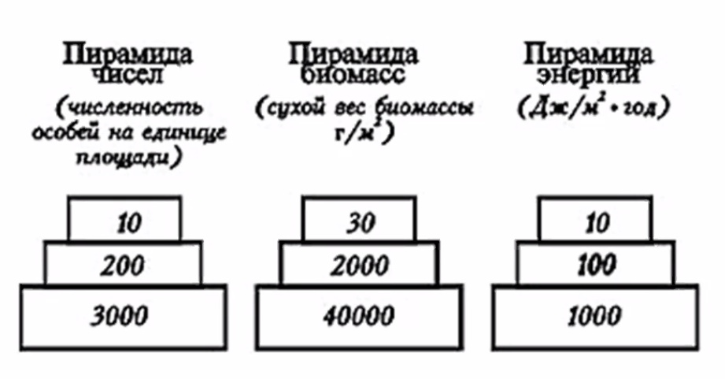

​								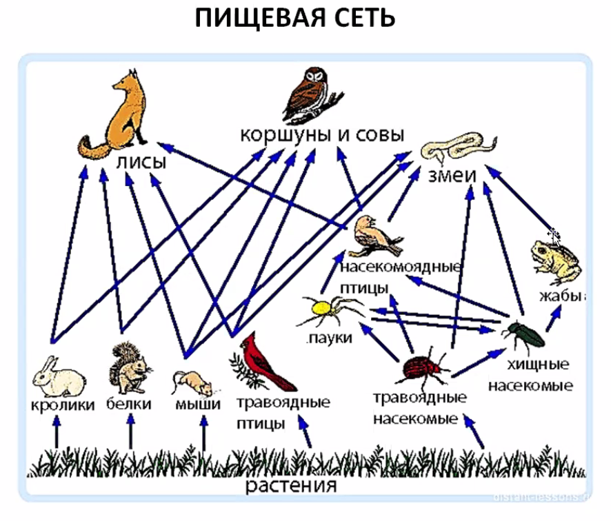 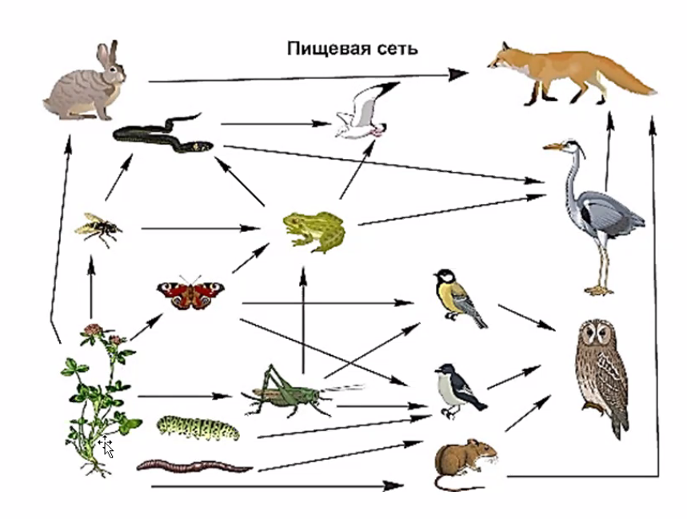

*Консументы какого порядка люди? 4.5-го?*

### Естественная и искусственная экосистемы

Естественная: много разных культур в состоянии конкуренции

Искусственная: только одна культура, «монокультура», та, которая требуется

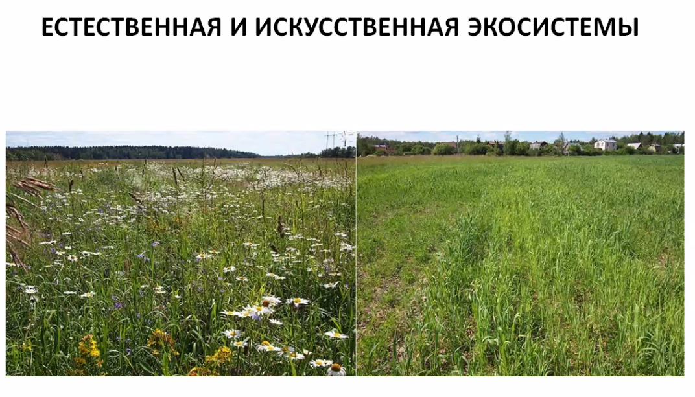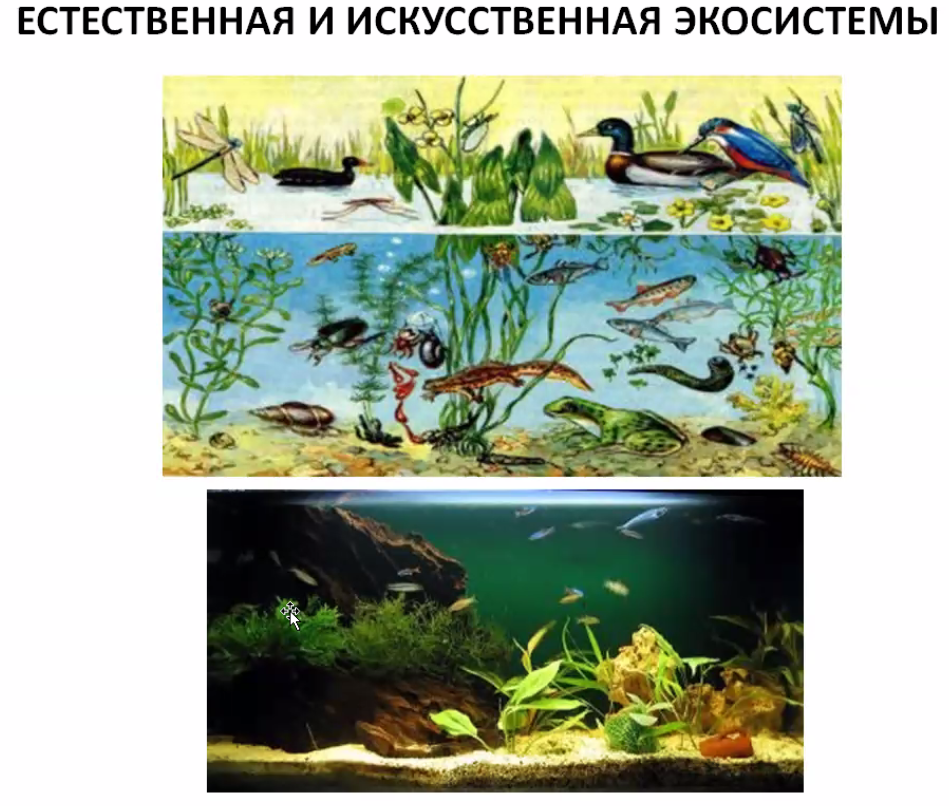

Из-за несовершенства системы аквариума, например, приходится время от времени продувать и чистить аквариум (в отличие от естественной системы)

Ещё не помешало бы добавлять энергию, кормя рыбок освещая аквариум.

Вывод (запомнить): искусственные *«эко»*системы нестабильны, требуют поддержки.

____

##### Пастбищные и детритные пищевые цепи

Пастбищные пищевые цепи: продуценты входят в биоценоз (пищевую цепь), то есть «в наличии», именно они и создают первичную продукцию. Цепей этого вида — большинство. 

Детритные пищевые цепи (от слова «детрит» — органический осадок): изначальная энергия приходит из этого осадка. По сути, цепи, в составе которых нет собственных продуцентов. В такие биоценозы органические вещества попадают извне (отсюда и название). «Детрит» в своём первоначальном значении — органически осадок на дне водоёмов, куда сверху с верхних слоёв водоёма попросту падает органика (манна небесная такая), а на дне есть свои  биоценозы «**бентосные**». 

**Бентос** — обитатели дна, те, кто живут на дне. 

**Планктон** — не живёт на дне, а двигается неактивно (*крайне* пассивны).  

Детритные пищевые цепи — в первую очередь бентосные.

Детритные пищевые цепи не могут саморегулироваться. Легко разрушаются.

Сукцессия — либо образование биоценоза там, где его не было вообще (первичная сукцессия), либо (что чаще) естественная замена одной системы другой.

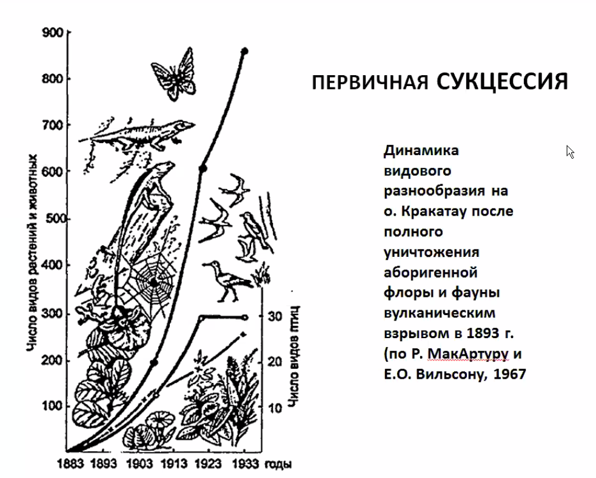

В конце 19го — начале 20-го веков было извержение вулкана с невиданной силой. Остров был уничтожен, потом восстал из мёртвых. Флора и фауна были уничтожены. Туда приехали учёные и стали измерять динамику видового разнообразия на острове в течение 50и лет.  «Насекомые и птички» довольно быстро пришли туда, а другие твари — дрожащие — сильно позже. Начало заселения — не с высших растений, а с тех, кто может почву создать, маленьких.

Амосова Людмила Ивановна имела честь лицезреть первичную сукцессию рядом с домом. [см. Сайт АУ](https://spbau.ru/ob-universitete/kafedryi/kafedra-nanobiotexnologij/pps/amosova-lyudmila-ivanovna). Там, где было безжизненное пространство, потом лишайники, те, кто может создать почву, в итоге стал расти лес.

#### Вторичная сукцессия

 Зарастание вырубок или гарей

***Вторичная сукцессия*** — закономерная замена одного биоценоза другим.

1. Зарастание вырубок или гарей в наших широтах обычно начинается с ***иван-чая*** 
2. 

3. 

4. 

5. 

6. 

Так вырубка или гарево превращается в полноценный хвойный лес.

Так выглядит примерная последовательность:

Только для небольших водоёмов, поэтому в садово-парковом хозяйстве их чистят:

Пример зарастания из реальной жизни:

Важно возвращать в окружающую среду биогенные элементы ($C, H, O, N, P, S$) — иначе экосистема буден неустойчивой. Они могут истощаться, поэтому нужны редуценты, превращающие органические вещества в неорганические. Чем более полно будут происходить, тем более устойчив биоценоз, в противном случае начинаются всякие процессы, которые приводят к сукцессии.

## Биосфера

— это живая оболочка земли. Та часть поверхности планеты, на которой есть жизнь. Термин был предложен неким Василием Ивановичем. Вернадским, оказывается.

Выше озонового слоя организмы жить не могут, так как:

1. Ультрафиолет
2. Холодно
3. Малая концентрация воздуха

Биосфера — довольно тоненькая оболочка, только где возможна жизнь, есть много ограничивающих факторов.

Главная часть — у самой поверхности земли.

