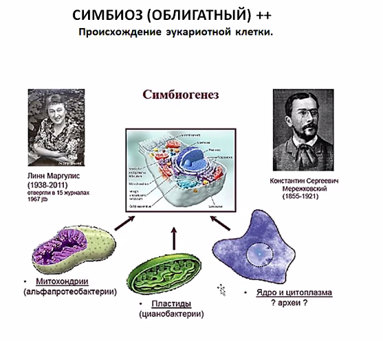

# Экология

Это нетолько охрана природы.
Это наука о взаимоотношениях организмов и охране окружающей среды.

#### Факторы среды:
- Биотические факторы - другие организмы из живой среды
- Абиотические - не из живой природы
- Антропогенные - от людей

#### Предел выносливости 
это значение фактора, 
за границами которых существование данного вида организмов невозможно

График зависимости интенсивности жизнедеятельности (то есть колчества особей)
от значения фактора — нормальное распределениие

Факторы - температура, влажность и «прочая дрянь».

Существуют зона оптимума и зона пессимума

</img>

</img>

#### Эвритермные организмы — выдерживают колебания температуры в широких пределах
Пример: песец


#### Стенотермные организмы — выдерживают колебания температуры в УЗКИХ пределах
Пример: коралловые полипы (≈20°C)

#### Эвригалинные организмы — выдерживают колебания СОЛЁНОСТИ в широких пределах
Примеры: Лососёвые (Сёмга, Горбуша…)

### Правило ограничивающих факторов (Правило Либиха / закон минимума)
```c++
                                                    ^^^ ←←← Химик
```
«Возможность существования организмов в первую очередь ограничивают те факторы среды, 
которые наиболее отклонятюся от оптимума»


</img>

«оса агаонида» — фиговая оса — опылитель инжира

Ограничивающие факторы: 
- Север $\Longrightarrow$ температура
- Пустыня $\Longrightarrow$ влажность
- … $\Longrightarrow$ …
…


Хладнокровные — «» — $t_{вокруг} = t_{внутри}$

Морфологические адаптации

Согревание за счёт мышц при низких температурах окружающего воздуха 
Испарительная терморегуляция

______________________________________________

#### Морфолгические способы регуляции водного баланса у животных:
- Эпикутикула
- Раковина моллюсков

#### Физиологические способы регуляции водного баланса
- Обратное всасывание
- Мочевина
- Метаболическая влага (горбы верблюда)

#### Светолюбивые растения (гелиофиты)

#### Теневыносливые растения
Цветовая мозаика (одни листья не затеняют другие)


### Ориентация у животных и свет
(Для ориентации в пространстве животным действительно нужен свет)


##### Органы зрения. 
- Головоногие моллюски, осьминог
- Млекопитающие почти не имеют цветного зрения
- Птицы имеют
- Гипертрофия глаз

Танцы пчёл связаны с солнцем и его перемещением
Перелёты птиц


Фотопериодизм — реакция организмов на сезонные изменения длины дня


## Биотические (теперь не только А'биотические) факторы
### Взаимодействия в природе
- Нейтральные (нейтрализм: ø:ø)
- Взаимополезные: +:+
    - Симбиоз
    - Мутуализм / протокооперация <- Если протокооперация, то обязательно взаимовыгдоно
- Полезно-нейтральные: +:ø
    - Комменсиализм
- Полезно-Вредные: +:-
    - Хищничество
    - Паразитизм
- Взаимно-вредные: -:-
    - конкуренция


#### Протокооперация
</img>

#### Мутуализм
</img>
</img>


#### Симбиоз — облигатный мутуализм. «ОБА Не могут жить друг друг без друга»
</img>
</img>
</img>
</img>

#### Теория симбмогенеза — теория происхождения эукариотной клетки
Общепринято, что были некоторые бакткрии. В результате симбиоза некоторые типы были поглощены клеткой хозяином 
(с ядром; способной к фагоцитизу) и стали метахондриями / пластидами.
</img>

## Экосистемы

#### Определения

Биотоп — участок поверхности с определенными абиотическими условиями, на котором существует сообщество организмов.

Биоценоз — совокупность организмов, обитающих на участке внешней среды с однородными условиями (т.е. в биотопе в течение длительного времени)

> Лужа — не биоценоз, так как она пересыхает

Экосистема примерно соответствует биоценозу, но более широкое понятие. Очень распространенное понятие. «Экосистемой можно считать все что угодно: от капли воды до океана».

Биогеоценоз — совокупность условий внешней среды + биоценоз. Т.е. учитывает и внешнюю среду, и сами организмы. 

Популяция (существует длительное время):

- часть населения вида, обитающая на определенной площади, где происходит обмен генетической информацией и взаимодействие особей

Показатель процветания популяции — высокая численность.

Организмы в биоценоз, в первую очередь, объединяют трофические отношения (кто кого ест, пищевые отношения).

 Бесконечное преобразование энергии.

Пищевая цепь — ряд организмов, связанных друг с другом пищевыми отношениями. По ним идет перенос энергии. Основной источник энергии — Солнце, затем продуценты (~~растения~~ фотосинтетики, превращают Солнечную энергию в энергию связей). Органику потребляют травоядные, затем хищники разного порядка — разные трофические растения.

 Трупы нужно перерабатывать, чтобы мертвая органика не накапливалась. Т.е. остатки должны быть возвращены в неживую природу. Этим занимаются детритофаги, "переработчики мертвой органики" — черви, грибы, бактерии и т.д. 

Важно:


(не буду повторять соответствия, слишком очевидно)

Без любого из элементов все может развалиться.


В пищевой цепи энергия идет как:


На каждом из трофических уровней — огромные потери энергии. <u>На порядок</u>. Потери на дыхание, CO~2~, H~2~O. Не вся продукция с одного уровня переходит на следующий; часть теряется при гибели и т.д. Отсюда — чем дальше, тем меньше биомасса. Самая большая биомасса — у автотрофов.

 

Возврат веществ в экосистему. Графическое изображение (пирамиды, снизу — нижние уровни, сверху — высшие): 


«Парадоксальные» формы могут встречаться на пирамиде численности из-за размеров организмов (при этом пирамида биомассы остается такой же):


### Пищевые отношения 

##### (прямо как производственные: все кушают друг друга)

- Продуценты — генерируют органику из минеральных веществ

- Консументы (1, 2, 3, 4, «*5*» порядков): консументы n-ного порядка поедают консументов (n - 1)-го порядка и регулируют их численность, если n != 1, иначе — питаются продуцентами. Консументы «*5*»-го порядка — это паразиты

- Редуценты (трупоядные, грибы, бактерии): разлагают органику

  Происходит потеря энергии при движении к более высокому трофическому уровню.

  ______

  ###### Пирамиды, демонстрирующие это:

  


​								 

*Консументы какого порядка люди? 4.5-го?*

### Естественная и искусственная экосистемы

Естественная: много разных культур в состоянии конкуренции

Искусственная: только одна культура, «монокультура», та, которая требуется


Из-за несовершенства системы аквариума, например, приходится время от времени продувать и чистить аквариум (в отличие от естественной системы)

Ещё не помешало бы добавлять энергию, кормя рыбок и освещая аквариум.

Вывод (запомнить): искусственные *«эко»*системы нестабильны, требуют поддержки.

____

##### Пастбищные и детритные пищевые цепи

Пастбищные пищевые цепи: продуценты входят в биоценоз (пищевую цепь), то есть «в наличии», именно они и создают первичную продукцию. Цепей этого вида — большинство. 

Детритные пищевые цепи (от слова «детрит» — органический осадок): изначальная энергия приходит из этого осадка. По сути, цепи, в составе которых нет собственных продуцентов. В такие биоценозы органические вещества попадают извне (отсюда и название). «Детрит» в своём первоначальном значении — органически осадок на дне водоёмов, куда сверху с верхних слоёв водоёма попросту падает органика (манна небесная такая), а на дне есть свои  биоценозы «**бентосные**». 

**Бентос** — обитатели дна, те, кто живут на дне. 

**Планктон** — не живёт на дне, а двигается неактивно (*крайне* пассивны).  

Детритные пищевые цепи — в первую очередь бентосные.

Детритные пищевые цепи не могут саморегулироваться. Легко разрушаются.

Сукцессия — либо образование биоценоза там, где его не было вообще (первичная сукцессия), либо (что чаще) естественная замена одной системы другой.


В конце 19го — начале 20-го веков было извержение вулкана с невиданной силой. Остров был уничтожен, потом восстал из мёртвых. Флора и фауна были уничтожены. Туда приехали учёные и стали измерять динамику видового разнообразия на острове в течение 50и лет.  «Насекомые и птички» довольно быстро пришли туда, а другие твари — дрожащие — сильно позже. Начало заселения — не с высших растений, а с тех, кто может почву создать, маленьких.

Амосова Людмила Ивановна имела честь лицезреть первичную сукцессию рядом с домом. [см. Сайт АУ](https://spbau.ru/ob-universitete/kafedryi/kafedra-nanobiotexnologij/pps/amosova-lyudmila-ivanovna). Там, где было безжизненное пространство, потом лишайники, те, кто может создать почву, в итоге стал расти лес.

#### Вторичная сукцессия

 Зарастание вырубок или гарей

***Вторичная сукцессия*** — закономерная замена одного биоценоза другим.

1. Зарастание вырубок или гарей в наших широтах обычно начинается с ***иван-чая*** 
2. 

3. 

4. 

5. 

6. 

Так вырубка или гарево превращается в полноценный хвойный лес.

Так выглядит примерная последовательность:


Только для небольших водоёмов, поэтому в садово-парковом хозяйстве их чистят:


Пример зарастания из реальной жизни:


Важно возвращать в окружающую среду биогенные элементы ($C, H, O, N, P, S$) — иначе экосистема буден неустойчивой. Они могут истощаться, поэтому нужны редуценты, превращающие органические вещества в неорганические. Чем более полно будут происходить, тем более устойчив биоценоз, в противном случае начинаются всякие процессы, которые приводят к сукцессии.

## Биосфера

— это живая оболочка земли. Та часть поверхности планеты, на которой есть жизнь. Термин был предложен неким Василием Ивановичем. Вернадским, оказывается.


Выше озонового слоя организмы жить не могут, так как:

1. Ультрафиолет
2. Холодно
3. Малая концентрация воздуха

Биосфера — довольно тоненькая оболочка, только где возможна жизнь, есть много ограничивающих факторов.

Главная часть — у самой поверхности земли.

#### Глобальный круговорот углерода


Фотосинтез $\Leftrightarrow$ дыхание

Энергия в виде АТФ


Осушать болота — отвратительная практика! Появляется много CO2, то есть появляется парниковый эффект.


 Азот «нужон». Например, для ДНК, аминокислот.

Берётся он из атмосферы, там его больше 70и процентов, посредством нитрофиксации, особенно за счёт бобовых, а именно — симбионтов на клубеньках. Далее «усвоенный растениями» азот передаётся вверх по пищевой цепи.

Продукты азотистого обмена:

- Мочевина → Аммиак, соли Аммония

### Сера

Получается в основном из литосферы


### Фосфор


Периоды разных круговототов:


## Человек и Биосфера


> Болота — лёгкие планеты!


Монокультуры: 

- Обедняют то место, где они находятся
- Требуют затрат человеческой энергии


## Некролог


## Происхождение жизни

Определения геологических возрастов:


Знание периодов полураспада необходимо для определения абсолютного геологического  возраста различных субстанций:


Напомним, что земля и СС появилась 

Жизнь образовалась 


Нужен $C, H, N, O, P, S — CHNOPS$

На Земле он был, было всё довольно неплохо. Размер, отдаление от Солнца $\Longleftrightarrow$ температура, хороший состав атмосферы (метан, …)

Сначала не было кислорода в атмосфере, он пошёл на окисление других элементов, и, соответственно, не было и озонового слоя, всё излучение лупило прям по поверхности планеты.

Атмосфера имела «восстановительный» (не «окислительный») характер, не было кислорода, была синильная кислота.


Доказательства невозможности самостоятельного зарождения жизни?

Первым, кто это «доказал», был Луи Пастер.


Динамика состава атмосферы:


Жизнь  зарождалась в АКИЯНЕ

### **Абиогенное происхождение жизни возможно:**


Фокс полагал, что между слоями слюды были капилляры, в которых могла быть более высокая концентрация веществ. Была ещё теория о том, что есть какие-то пористые минералы, обладающие вышеупомянутым свойством.

### Новый эксперимент


# Более современные теории происхождения жизни

Предположительный путь образования РНК:

 


### Гипотеза мира РНК

> Первые крупные молекулы, которые существовали на Земле во время зарождения жизни, были РНК-ами

ДНК — просто более или менее надёжное хранение информации, но самовоспроизводиться оно не умеет.

 

РНК — это праймер, он необходим для ~~зачатия~~ начала реакции.

5. Способность РНК к автокаталитическим реакциям (продукт реакции катализирует саму реакцию, то есть реакция всё сильнее и сильнее ускоряется)


Эукариоты — есть ядро, есть как мембранные, так и немембранные органоиды.

**Про**кариоты (Бактерии и Археи): не имеют ядра и мембранных органоидов.


Гипотеза:

> Происхождение всех клеточных организмов  — едино!


> ДНКполимераза — полимеризует ДНК (редуплицирует)


…

### «Эстремофилы»: экстримальные условия


…


…


# Жизнь в докембрии


…

Начиная с палеозоя начинается “эра «явной» жизни”, появилось много палеонтологических остатков, до этого было гораздо меньше, и дело тут не столько в долгом времени требуемого сохранения. Появилось то, чему схораняться.

Мнемоническое правило для запоминания периодов палеозойской эры:

**К**аждый **о**тличный **с**тудент **д**олжен **к**урить **п**апиросу.


Если институт «геологии докембрия», то есть термин «докембрий» вполне общепризнан.


Хронология докембрия:


…

Мембрана:

1. «Ограничивающая»
2. Избирательная проницаемость
3. Производство энергии


Самые древние свидетельства органической жизни: 3.8 млрд лет назад, остальное — видами по воде писано. 


…


…

Состав атмосферы изменился именно за счёт ивой природы, например, фотосинтетиков.

Изначальное распределение жизни:


Были проблемы с тем, чтобы жить над водой, так как не было озонового слоя $\Rightarrow$ приникал УФ в большом количестве — мутоген.

### Происхождение эукариот

Изменение содержания кислорода в атмосфере:


А районе точки Пастера: «кислородная революция» было насинтезировано столько кислорода (1% от содержания кислорода в атмосфере на данный момент) $\Rightarrow$ появились ***аэробные*** формы, можно было всплывать к поверхности.

О земле разговор тогда ещё не шёл.

Когда кислорода стало ещё больше, появились эукариоты.

У этого были и негативные последствия. Снижалась температура, так как меньше $CO_2$, то есть мЕньший парниковый эффект.

Аноэробная фауна во многом передохла. Выжили только те, кто сумел приспособиться. 


…


…


Итого: стромитолиты — совокупность/сообщество прокариотов с разным обменом веществ.


Маргулис предположила, что эу клетник проихошли путём загшлатывания.


(А это балнгодаря фагоицтохв)

А для эторгнр нажэно было синтезироватьб сократимые былки

Например, актин

(быывает ещё меозин)


Но как появилось ядро?


ЭТО ПОРЯСЕНИЕ, РЕЗУЛЬТАТ ДВОЙНОГО СИМБИОЗА!!!!!!!!!1111111!!!!!!


Он его сожрал. Такая у НИХ ЛЮБОВЬ НА ТРОИх ъ.