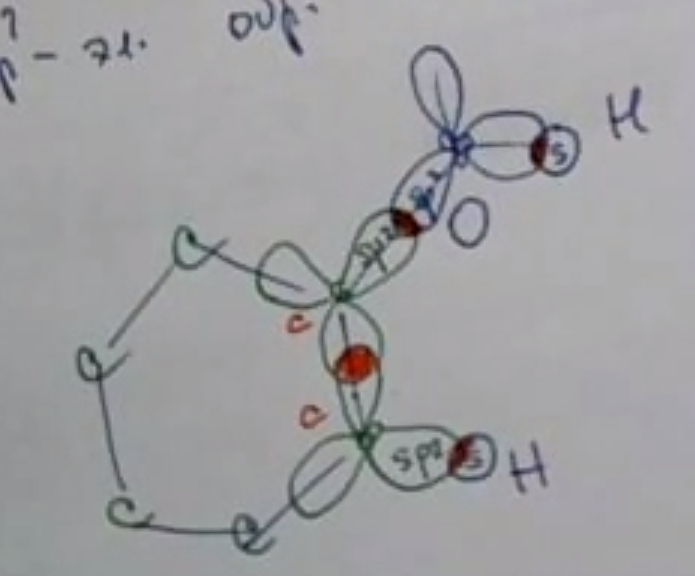
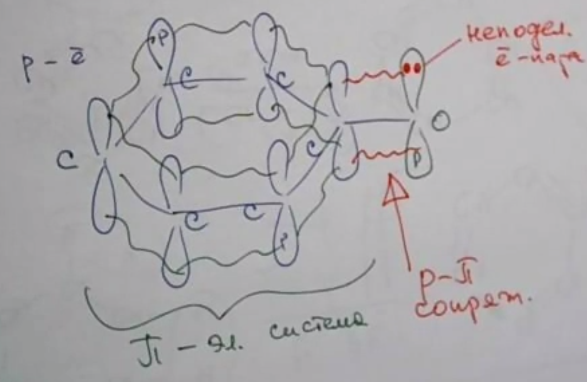
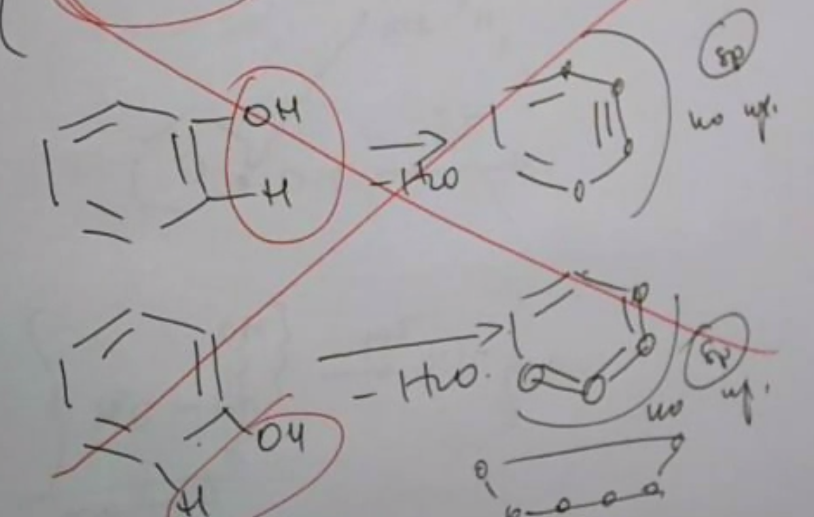

## Chemistry conspect for 2021-02-02, by Ipatov Mark

## Фенол
ака Гидроксибензол

{БЕНЗОЛ}-OH
Фенол - первый простейший представитель фенолов. Одноатомный.
Не путать с ароматическими спиртами. Фенол - не ароматический спирт.
В ароматических спиртах группа OH стоит в боковых цепях, а не на кольце.
Например
{БЕНЗОЛ}-CH2OH -- бензиловый спирт

# Строение

Атомы углерода во втором валентном состоянии - sp2 гибридизация.
         [/]
[/][/][/] p
(sp2)

Атомы кислорода в sp2 гибридизации
           [X][/][/]			   [X]
Было: O [X]	p	-(sp2)->  [X][/][/] p
	 s			    (sp2)

Почему так? Вроде же невыгодно. А для возможности образовать связи, которые дадут выигрыш в энергии, который перекроет проигрыш

sp2 --> образуют сигма связи	"C-H", "C-O", "C-C", "O-H"  -- всё это - гибридными электронами

</img>

От бензола образуется пи-электронная система. А рядом стоит кислород, с негибридной p-орбиталью, в которой живёт неподелённая пара электронов. Получаем p-пи сопряжение.

Поэтому кислород не вращается вокруг сигма связи (т.к. сопряжение), поэтому всё всё равно в одной плоскости.

</img>

У группы OH есть два эффекта.
1. Кислород тянет на себя электронную плотность -- отрицательный индуктивный эффект
2. Неподелённая пара толкает электронную плотность -- положительный мезомерный эффект.

Второй гораздо сильнее первого.
Из-за этого в кольце возрастает электронная плотность.

Поэтому:
1. Реакции электрофильного замещения идут лучше, чем в бензоле.
2. Электронная плотность в кольце перераспределилась, и образовались "сгустки" электронной плотности -- атомы с повышенном (-) зарядом у атомов 2, 4 и 6 (орто (2 и 6) и пара (4)), куда и направлена в основном реакция Se. Таким образом группа OH -- ориентант первого рода.

А как кольцо влияет на OH?

H -> O -> [БЕНЗОЛ]

Из-за p-пи сопряжения неподелённая электронная пара атома кислорода делокализована - "размазана" по всей молекуле, что приводит к увеличению полярности связи HO и увеличению кислотных свойств (по сравнению со спиртами. Да, фенол сильнее многоатомных спиртов).
Кстати, фенол ещё называют карболовой кислотой. Сильнее самого сильного одноатомного спирта (метанола) в несколько тысяч раз. Но при этом фенол всё ещё очень слабая кислота. Но уже чуть лучше относительно воды.

# Физические свойства

Как у всякого гидроксисоединения, у фенола есть водородные связи. А ещё весьма приличная масса.
Агрегатное состояние: твёрдое вещество, но довольно легкоплавкое.
Примерно прозрачный.
В холодной воде растворяется плохо (большой гидрофобный радикал), но при нагревании растворимость сильно возрастает (в горячей воде -- сколь угодно растворим).
Ядовит. Обладает антисептическим действием.

## Химические свойства

1. Можно сжечь. Ничего необычного.
2. Возможна реакция присоединения. Не является характерной, но
[БЕНЗОЛ]-OH + 3H2 -(t, Ni)-> [ЦИКЛОГЕКСАН]-OH
Эта реакция никому не нужна.

3. Реакция электрофильного замещения -- характерная. У фенола идут лучше.

I. Галогенирование
					Br
[БЕНЗОЛ]-OH + 3 Br2 ----> 3HBr + Br-[БЕНЗОЛ]-OH (выпадает белым осадком) -- 2,4,6-трибромфенол
					Br

Идёт даже с бромной водой очень хорошо. Характерная реакция.

II. Нитрованиею
Бензол работал только с концентрированной азотной, и то, только в присутствии концентрированной серной.
А фенол может работать с разбавленной.

ФЕНОЛ + HO-NO2 (р.) -(-H2O)----> ФЕНОЛ-NO2  -- орто
		            \--> ФЕНОЛ-NO2  -- пара

Но если кинуть концентрированную, то
				  NO2
ФЕНОЛ + 3HO-NO2 (к.) -(3H2O)---> ФЕНОЛ-NO2 -- 2,4,6-тринитрофенол а.к.а. пикриновая кислота.
				  NO2
Имеем три нитрогруппы, поэтому очень взрывчатое. 
Имеем три нитрогруппы, поэтому электронная плотность перетянута, поэтому электронная пара от O ещё сильнее уходит в кольцо, поэтому OH очень сильно поляризована, поэтому пикриновая кислота -- сильная кислота. 

III. Сульфирование
Больше одной сульфогруппы в кольцо не влезает.

ФЕНОЛ + HO-SO2OH (конц.)  -(-H2O)----> Ортосульфофенол  (2)
				  \--> Парасульфофенол  (4)

Но у фенола же есть ещё и гидроксогруппа.

## Реакции гидроксогруппы

4. Кислотные свойства

Вспомним, что метанол уже со щёлочью не реагировал. А фенол крутой:

ФЕНОЛ + Na -> [КОЛЬЦО]-ONa + 1/2 H2
И
ФЕНОЛ + NaOH -> [КОЛЬЦО]-ONa + H2O
		 Вот эта соль - фенолят натрия.

Но, так или иначе, кислотные свойства всё ещё слабы.

В водном растворе фенолята среда -- ... (вписать дома), так как там происходит ... (вписать дома), идущий по уравнению: ... (уравнение в молекулярной форме)
... (уравнение в ионной форме)

Из фенолятов фенол легко вытесняется. 

Фенолят натрия + HCl ---> ФЕНОЛ + NaCl

и даже

Фенолят натрия + H2O + CO2 ---> ФЕНОЛ + NaHCO3 (кислая соль)
		"H2CO3"

## Обратно к спирту

5. Дегидрирование
Воспоминание:
     H
H3C-CH -(-H2)-> ...
    OH

[КОЛЬЦО]-OH   -(-H2)-> ничего не получилось

У нас нет атома H на "OH"-ном углероде.

6. Внутримолекулярная дегидратация
Воспоминание:
H2C-CH2 -(-H2O)-> ?
 H  OH 

</img>
ДЕГИДРАТАЦИЯ НЕВОЗМОЖНА ПО ГЕОМЕТРИЧЕСКИМ И ЭНЕРГЕТИЧЕСКИМ СООБРАЖЕНИЯМ

7. Межмолекулярная дегидратация
Воспоминание:
CH3OH + HOCH3 -(-H2O)-> ?

Группа OH из-за сопряжения очень прочно привязана к кольцу из-за сопряжения. 
А простые эфиры получают из солей
Фенолят натрия + ClCH3 -(-NaO)-> Метиловофениловый эфир. Радикал бензола, кстати, называется фенил.

### Получение

1. Хлорбензол + NaOH  -(t, P!, -NaCl)-> Фенол

Реакция не совсем корректная, точнее будет

Хлорбензол + 2NaOH -(...)-> Фенолят натрия, из которого потом легко получить фенол.

2. Кумольный способ

Кумол -- изопропилбензол
       CH3                CH3                               CH3
БЕНЗОЛ-CH + O2 --> БЕНЗОЛ-C-O-OH -(H2SO4)-> БЕНЗОЛ-OH + CH3-C=O(это ацетон)
       CH3                CH3
первая реакция идёт с катализатором. 

## ДЗ

Повторить теорию и привести в порядок практику
10.5 10.6
10.7, в пункте г заменить исходный дивинил на изопрен.

Кто читает это тот крутой
