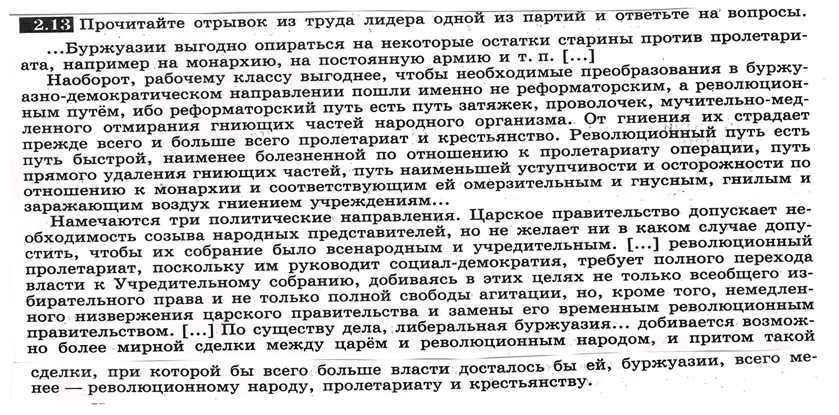

## Определение политической позиции по отрывку из некоторого труда лидера одной из партий

### Фрагмент текста:

### Вопросы

1. О каких двух путях социальных преобразований пишет автор?
2. Автор является марксистом. Докажите, опираясь на текст.
3. Автор большевик или меньшевик? Докажите. Опираясь на текст

### Какие вопросы такие и ответы — конструктивные!

Для начала заметим, что это, очевидно, Ленин (например, потому что это марксист-*ленинист*, занимающийся революцией в России). Да и по стилю письма похоже.

1. Автор рассматривает 2 принципиально разных способа реформирования общества: «реформаторский» и «революционный», причём утверждает, что «реформаторский» выгоден буржуазии, а «революционный» — пролетариату. «Революционный», соответственно, способ — не попытка демократизации существующей царской системы, а социалистическая революция.
2. Автор акцентирует внимание на классовой борьбе: пролетариата и буржуазии, справедливо критикует «либеральную буржуазию», так как она не ставит себе цель установить «настоящую демократию», а лишь «добивается возможно более мирной сделки с царём и революционным народом». В среднем же буржуазия, отмечает автор, реакционный класс, ей выгодно опираться на старые символы, «остатки старины». Политик отмечает, что несмотря на общего врага буржуазии и пролетариата с крестьянством — царского режима, интересы этих классов всё ещё сильно отличаются и станут противоположными в случае реализации буржуазной революции. Причём автор встаёт на сторону пролетариата в этом противостоянии и описывает, каким именно образом пролетариат и крестьянство должны достигнуть своих целей. Все эти положения согласуются с марксистской теорией.
3. Очевидно, что автор большевик. Он прямым текстом пишет, что «рабочему классу выгоднее, чтобы необходимые преобразования … пошли ***именно не реформаторским, а революционным образом***», а наличие такого мнения как раз и делает его большевиком. Развивая мысль, политик  применяет к реформаторскому методу преобразований такие эпитеты, как «путь зятяжек», «путь проволочек», «путь медлительного отмирания гниющих частей народного организма». По поводу же вопроса об удержании власти после преобразований, Ленин, как известно, считает, что следует применит систему советов и диктатуру пролетариата, а не буржуазную демократию — в отличие от меньшевиков, но об этом в приведённом фрагменте почти не упоминается.