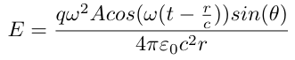

### Physics conspect for 27-11-2020, by Ipatov Mark

## Напоминание:

</img>

## Про излучение и приём

Вспомнить: Скорость движения электронов - порядка мм/с
Тогда при переменном колебании они будут смещаться примерно на размер атома

Антенна выглядит как-то так:

</img>

# Какой длины должна быть антенна?

- Каждый электрон создаёт свою сферическую волну
- Итого будет излучаться множество сферических волн, и нужно смотреть на их интерференцию.
</img>

Давайте поставим </img>, тогда разность хода почти никогда не будет равна </img>, тогда полной деструктивной интерференции почти не будет.

# Диаграмма направленности

</img>
Модуль вектора показывает интенсивность излучения в конкретном направлении.

Дециметровая антенна (просто бывает):
</img>
Круглая часть требует почти строгого направления на источник.

## Радио

Нужно передать звук частотой примерно 1кГц. Но 1кГц слишком низкая частота для вещания, плюс если все будут вещать на одной частоте, то приём сигнала будет невозможен.

# Амплитудная модуляция (AM)
Возмём несущую частоту $omega0_=89МГц. Тогда давайте сделаем так, чтобы звук был огибающей для передаваемого сигнала. Для этого будем менять амплитуду несущей частоты:
</img>
Тогда энергию можно записать следующим образом:

Занимаемые таким образом частоты будут образовывать полосу длиной порядка 100кГц. Принимающая сторона может усилить приём на этом окне и таким образом, построив там как-то огибающую, получить сигнал.

# Частотная модуляция (FM)
Давайте сохраним амплитуду, но будем местами "сжимать и расширять" сигнал. Пожалуйста, дополните эту часть конспекта, если у вас она есть.

Пусть мы хотим передать писк на частоте $\delta\omega$, и вещаем мы на частоте $w >> \delta\omega$.
Пользуясь методом мы бы передавали сигнал $A\cdot cos(\omega)cos(\delta\omega)$ и получили бы огибающую, эмитирующую исходный звук.

Теперь же мы будем передавать сигнал $A\cdot cos(\omega+2\delta\omega)$.
Принимающая сторона из полученного сигнала вычитает колебание на основной частоте радиостанции и получается
$$A\cdot cos(\omega+2\delta\omega) - A\cdot cos(\omega) = -2A sin(\omega + \delta\omega)\cdot sin(\delta\omega)$$
Такой же сигнал мы и получали раньше.
# Радиолокация
TODO
